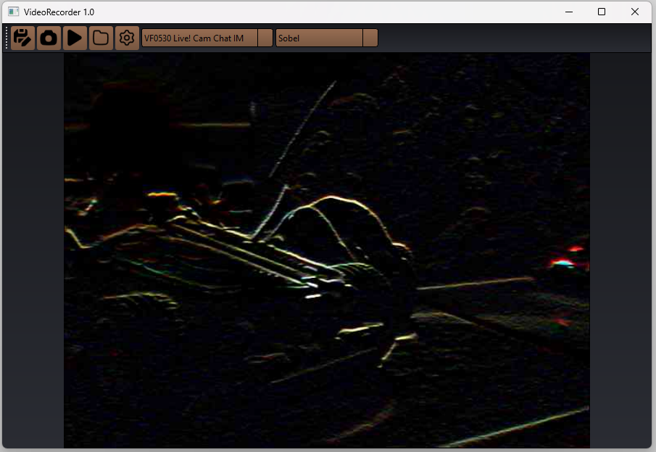

# VideoRecorder

VideoRecorder is my engineering thesis application for recording/filtering video-streams in realtime from usb/web camera.

---

About

VideoRecorder is a desktop application written in C++ for recording and filtering video-streams. It uses 3x3 convolution mask for filtering.

Main functionalities of this application consist of:

* recording video-streams
* filtering video-streams in realtime using a selection of filters:
  *  sharpening 
  *  blur
  *  laplacian filter
  *  sobel filter
  *  vertical prewitt filter
  *  emboss filter
  *  custom filter (you can input your own filter onto 3x3 grid)

---

Used technologies/tools

* [C++17](https://en.cppreference.com/w/cpp/17) 
* [CMake](https://cmake.org/) (v3.5+) 
* [Qt](https://www.qt.io/) 
* [OpenCV](https://opencv.org/) 
